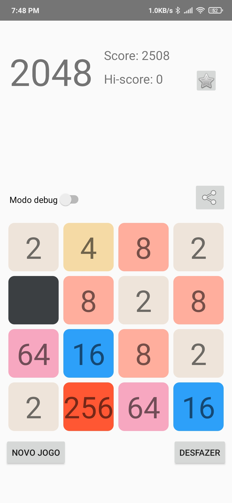

# 2047

A simple 2048 clone for Android.

 

## Features

- Classic 2048 gameplay
- High-score tracking (top 10)
- Undo button
- Share your score as a screenshot

## Requirements

- Android Studio
- Android device or emulator

## Installation

1. Clone the repository:
   ```bash
   git clone https://github.com/yourusername/2048-clone.git

2. Open the project in Android Studio.

3. Build and run the app on an emulator or physical device.

## Usage

1. Launch the app.

2. Swipe to move the tiles.

3. Combine tiles with the same number to reach 2048.

4. Your highest score will be saved automatically on game over.

To share your score, tap the "Share" icon button on the top right to take a screenshot and share it via your preferred method. The top 10 scores can be viewed by tapping the "⭐" icon on the top right.

## Acknowledgements

Inspired by the [OG 2048](https://play2048.co/).
